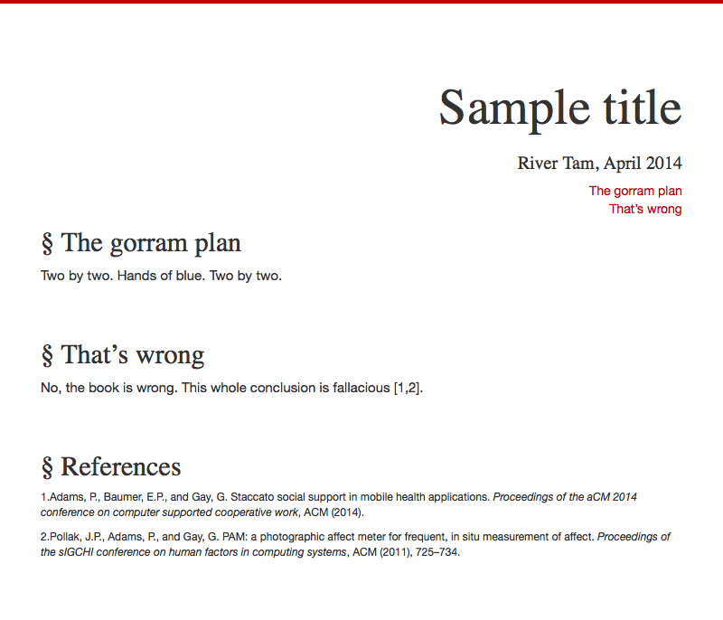

letterpress
===========

Given a nicely written document in pandoc markdown, output a pretty HTML
document. Complete with bibtex-based references and a mobile-first stylesheet.

To create `./gen` with all the necessary html and css files, ready for upload:

`shovel html sample`

Uses pandoc, normalize.css, bootstrap 3.x, shovel. CSL sheets are available at
https://github.com/citation-style-language/styles.

installation
------------

This project depends on bower (a node package) and pandoc (a Haskell package).
Tasks are called using shovel, a Python Make.  If you want PDF generation,
you'll also need a TeX library. If you've got these already, then simply run
`bower install letterpress`. Done.

installing all the dependencies
-------------------------------

If you'd like PDF generation, install TeX using MacTeX
(http://www.tug.org/mactex). You'll really only need the small BasicTeX
library.

Then we'll need pandoc:

    brew install haskell-platform
    cabal install pandoc

And bower:

    brew install node
    npm install -g bower

Last, shovel:

    brew install pip
    pip install shovel

And then just `bower install letterpress`. Done.
